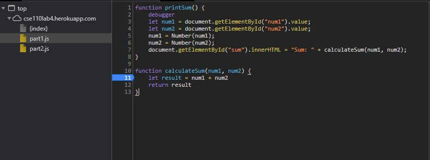

## Part 3 answers
1. ### DevTools - Debugging
   * The screenshot for breakpoint list is called [part1_breakpoint_list.JPG](part1_breakpoint_full.JPG). There is also a full screenshot includes the breakpoints on code named [part1_breakpoint_full.JPG](part1_breakpoint_full.JPG)
   * The screenshot for watch list is called [part1_watch_list.JPG](part1_watch_list.JPG). There is also a full screenshot includes the watched variable when debugger is paused named [part1_watch_full.JPG](part1_watch_full.JPG) 

   * ### What is the bug?
    
     The bug is caused by `num1` and `num2` being of type string, so the `+` operation will be treated as a string concatenation, and `result` will thus be a string that is the concatenation of strings `num1` and `num2`, instead of the desired arithmatic summation of number `num1` and `num2`.

   * ### How would you fix it?

     A way to fix the bug can be casting the variable `num1` and `num2` explicity to numbers, so that the `+` operator will have both operands being numbers. In this way, `+` will be treated as the arithmatic sum, and thus `num1+num2` will be the sum of `num1` and `num2` as desired. The variable `result` will thus hold a number vale that is equal to the sum `num1 + num2`.
     
     The code of fixed program is shown below. Changes are made on lines `5` and `6`
     
     
---
1. DevTools - Network Tab
   
    1. The name of the `json` file is `citylosts.json`
   
    2. `part2.js` initiated the download of the new file. Specifically, at line `2`.
   
    3. The file size of `citylosts.json` is 11.7MB
   
    4. It takes the `6.46` seconds to download `citylosts.json` on my machine. An image is included to show the download time.
    

    1. THe user agent appears to be `Mozilla/5.0 (Windows NT 10.0; Win64; x64) AppleWebKit/537.36 (KHTML, like Gecko) Chrome/88.0.4324.104 Safari/537.36`

    2. The file came from an `Apache` server.
   
    3. The file was last modified on **Tuesday, Janurary 26, 2021** at **22:14:13 GMT**
   
    4. The content type of the file is `application/json`
   
    5.  The `fetchData` function made the request.
